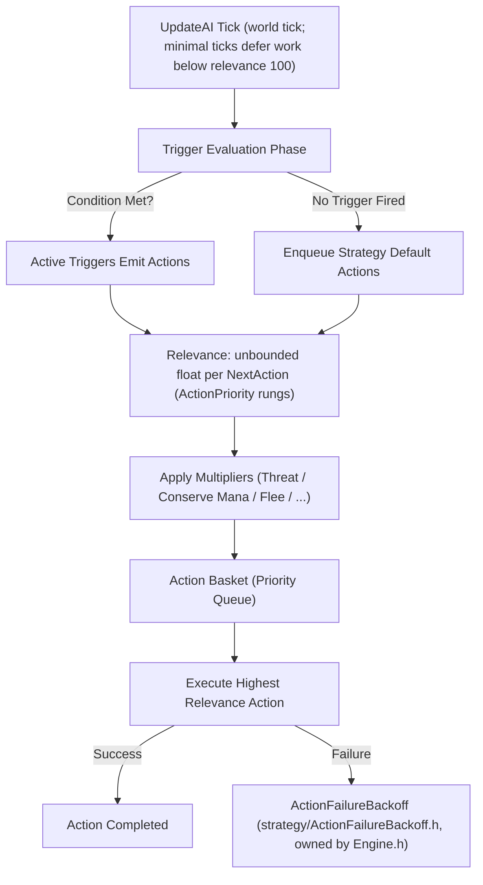

# Strategy Engine & Action Scheduling

TortoiseBots uses an action-scheduling engine derived from Playerbots. Rather than running a monolithic behavior tree or hardcoded FSM, bot behavior emerges from composable **Strategies**, **Triggers**, **Actions**, and **Multipliers**.

## The Execution Cycle

## Module Pass & World-Tick Scheduling

The module drives every bot from a single pass on the world thread (`BotManager::UpdateBots`, called from the module's `WorldScript` update, i.e. at the end of a world tick). Two ordered phases keep a real player's party responsive when the random pool is large:

1. **Player-owned bots first.** Bots a real player owns update first, on every tick, with no budget: a bot whose master is a live player with a network session (hired companions, party bots), and a bot on an account the random pool does not own (`tortoise_bots_pool_account`), i.e. the owner's own characters. Everything else is the pool — including pool characters that carry a master from a bot-only group, a stale `PlayerMaster` lease, or `random = false`. The decision lives in `runtime/PlayerBotClassification.h` (covered by `tools/test_player_bot_classification.cpp`); the lease and the `random` flag are bookkeeping, not ownership.
2. **Random pool second.** Everything else runs in a round-robin rotation held across ticks (`PoolPassRotation`, `runtime/PoolPassRotation.h`): each pass resumes where the previous tick stopped, so a bot that misses a pass is served on a later one and is never skipped permanently. Membership changes rebuild the rotation; the pass itself stays O(pool).

Only the pool phase can be cut short, and only while the previous world tick ran longer than `AiPlayerbot.PoolBudgetWhenTickOverMs` (default 0 = every tick, reclaimed to the full `AiPlayerbot.PoolTickBudgetUs` ceilings on healthy ticks by the `AiPlayerbot.TargetWorldTickMs` controller): the pass then stops at the effective pool budget and continues from the cursor on the next tick. See [Configuration Knobs & Feature Flags](../guides/configuration-tuning.md).

Every ~30 s of tick time the pass logs its own cost — `TortoiseBots: BOTPERF passUs=... playerBots=... ownedBots=... masterBots=... poolBots=... poolProcessed=... budgetHit=...` at module log level 1 or higher — which is the direct measure of how much of the world tick the AI pass owns. `ownedBots` + `masterBots` make up `playerBots`, so a pool bot that sneaks into the unbudgeted pass is visible in the log instead of silently stretching the tick.

## Core Building Blocks

| Component | Responsibility | Example Class / Implementation | Relevance / Effect |
| :--- | :--- | :--- | :--- |
| **Strategy** | High-level posture or intent container | `FrostMageStrategy`, `HealPaladinStrategy` / `HealPriestStrategy`, `PreHealStrategy`, `PullBackStrategy` | Registers triggers, actions, and defaults |
| **Trigger** | Context condition check | `CriticalHealthTrigger`, `LowManaTrigger`, `InterruptSpellTrigger` / `InterruptEnemyHealerTrigger` | Evaluates boolean state (`Check()` / `IsActive()`) |
| **Action** | Concrete world interaction or spell cast | `CastFlashHealAction`, `ReachSpellAction`, `EatAction` | Returns `true` on execution success |
| **Multiplier** | Contextual relevance adjuster | `ThreatMultiplier`, `ConserveManaMultiplier`, `FleeMultiplier` | Scales base action score (e.g. 1.5x, 0.0x) |
| **Backoff** | Anti-looping failure throttling | `ActionFailureBackoff` in `strategy/ActionFailureBackoff.h`, owned by `Engine.h` | Exponential TTL suppression on repeated failure |

---

## Action Relevance Tiers

Relevance is an unbounded float per `NextAction` (default `0.0f`); the action queue seeds its best-match search at `-400` with no clamp. The conventional rungs come from the discrete `ActionPriority` enum:

`ACTION_IDLE` (1), `ACTION_DEFAULT` (5), `ACTION_NORMAL` (10), `ACTION_HIGH` (20), `ACTION_MOVE` (30), `ACTION_INTERRUPT` (40), `ACTION_DISPEL` (50), `ACTION_LIGHT_HEAL` (60), `ACTION_MEDIUM_HEAL` (70), `ACTION_CRITICAL_HEAL` (80), `ACTION_EMERGENCY` (90), `ACTION_PASSTROUGH` (100).

Typical occupants: rotational DPS around `NORMAL`/`HIGH` (10–20), movement at `MOVE` (30), interrupts at `INTERRUPT` (40), heals climbing `LIGHT`/`MEDIUM`/`CRITICAL` (60/70/80), emergencies at `EMERGENCY` (90), passthrough overrides at 100. Strategies add small offsets (e.g. `ACTION_NORMAL + 3`) to order within a rung.
