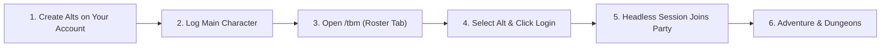

# Getting Started with TortoiseBots

TortoiseBots allows you to turn characters on **your own account** into intelligent companion bots to explore the open world, level together, and run 5-player dungeons.

## 1. Quick Setup Workflow



### Prerequisites
1. Create the characters you want to use as bots on your account.
2. Install the **[TortoiseBotsManager](https://github.com/Sagiroth/TortoiseBotsManager)** addon (`/tbm`) into your client's `Interface/AddOns/` directory.
3. Log into your main player character in the game.

## 2. Spawning Your Bots

You can manage your bots using the in-game UI (`/tbm`) or through native `.bot` chat commands.

### In-Game Addon (`/tbm`)
1. Type `/tbm` to open the control panel.
2. Switch to the **Roster** tab.
3. You will see characters from your account listed. Select a character and click **Login** / **Invite**.
4. The bot will appear as a headless session and join your party!

### Command-Line Shortcuts
Alternatively, type these commands in chat:
```text
.bot add <CharacterName>       # Log in an owned character as a bot
.bot invite <CharacterName>    # Invite bot to your party
.bot summon <CharacterName>    # Summon a bot to your location (needs AiPlayerbot.NonGmFreeSummon = 1 unless you are a GM)
```

> [!NOTE]
> **Human Reclaim:** If you want to play a character yourself that is currently running as a bot, simply log into it from the character select screen. The server will cleanly disconnect the bot and let you log in normally.

> [!TIP]
> **Fast Leveling & Training:**
> * Set `AiPlayerbot.SyncAltLevelToMaster = 1` in `aiplayerbot.conf` (next to `mangosd.conf`) and keep your owned bots in your group with you as leader: each gains one level per AI update until it matches your level.
> * Take your bots to class trainers in major cities and whisper them `trainer` (or type `.bot command <Name> trainer`) to have them learn all available class spells and ranks in one click!

---

## 3. Building a Balanced 5-Man Party

| Role | Recommended Classes & Specs | Primary Responsibilities | Tactical Strengths |
| :--- | :--- | :--- | :--- |
| **Tank** (1) | Protection Warrior, Feral Bear Druid, Protection Paladin | Holds primary threat on skull and adds, executes corner pulls | High mitigation, taunt mechanics, interrupt capabilities |
| **Healer** (1) | Holy Priest, Restoration Shaman, Holy Paladin, Resto Druid | Maintains party health, cleanses magic/poisons/diseases | Burst triage, group healing, mana efficiency |
| **Melee DPS** (1) | Combat/Assassination Rogue, Fury Warrior, Feral Cat Druid | Single-target melee burst, secondary interrupts | Lockpicking, stealth Sap, high sustain DPS |
| **Ranged DPS** (2) | Frost/Fire Mage, Marksmanship Hunter, Affliction Warlock | Ranged burst, crowd control, AoE control | Polymorph, Freezing Trap, Banish, conjured food/water |

---

## 4b. Which Build Are You Running?

Every merge to `main` stamps a per-merge build version `<UTC date>-v<N>`
(e.g. `2026-09-25-v3` is the 3rd real merge that UTC day; the counter resets
to v1 daily and each repo counts its own merges). The workflow's own
`[skip ci]` changelog commits never count.

Where to see it:

- Server log at startup: `TortoiseBots <version>` (or `dev` for a checkout
  without the stamped file), followed by the author credit and source link.
- In game, any player: `.bot version` prints the server build plus a
  `TBM:VERSION|<version>` protocol line for the addon.
- The `/tbm` window header shows `TBM <addon version> · server <server
  version>`; `server ?` means the server predates the version reply.

Tags and releases: each merge also gets a lightweight git tag `<version>`
pointing at its own commit. The daily `vYYYY-MM-DD` release and Discord post
stay as today, but the tag now moves to the day's latest version commit and
the notes open with the build range (e.g. `Builds 2026-09-25-v1 – v7`).

## 4. Basic Controls in the Field

| Intent / Action | `/tbm` Addon Button | Native Chat Command | Bot Behavior |
| :--- | :--- | :--- | :--- |
| **Regroup / Unstuck** | **Summon** | `.bot summon <Name>` | Immediately teleports one out-of-combat bot to your coordinates (requires `NonGmFreeSummon = 1` unless GM) |
| **Focus Target** | **Focus Skull** | `.bot action focus skull` | Directs all DPS bots to burst the raid-marked Skull target |
| **Pullback Pull** | **Pullback** | `.bot action pullback` | Tank pulls target with ranged attack and sprints back behind cover |
| **Hold Fire** | **Stay** / **Stop** | `.bot action stay` | Pauses movement and stops casting to prevent accidental adds |
| **Crowd Control** | **CC Mark** | `.bot action cc <icon>` | Assigns bot with matching CC kit to disable target |
| **AoE Control** | **AoE** | `.bot action aoe off` | Toggles Blizzard, Rain of Fire, Multi-Shot to protect CC |
