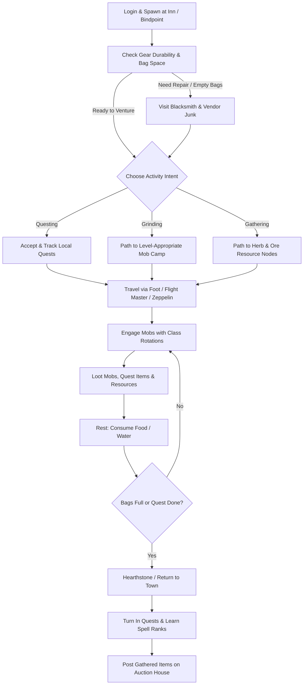
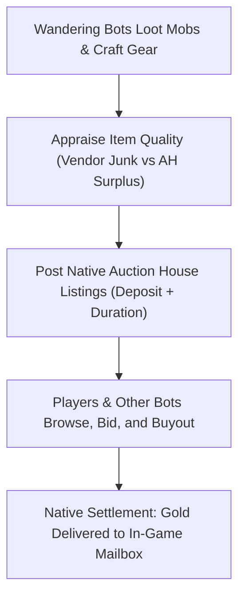

# Living World & Autonomous Bots

TortoiseBots is not limited to player-owned companions. It includes a complete **Living World** subsystem that populates your realm with autonomous bots on **managed pool accounts**. These bots explore zones, grind mobs, gather profession nodes, quest, trade on the Auction House, form parties, and create guilds—making the world feel vibrant and active like a populated MMO server.

> **What "managed" means.** A pool account is one recorded in the character-database table `tortoise_bots_pool_account`: either the module created it itself (auto-create or hiring) or an administrator adopted it explicitly at the server console. A username that merely starts with the configured prefix (`RNDBOT`) does **not** make an account a pool account — such accounts are ignored by the pool and are never reset. See [Resetting the managed bot pool](#resetting-the-managed-bot-pool).

---

## 1. Autonomous Bot Lifecycle



## 2. Wandering & Leveling Bots

Autonomous bots roam the open world, reacting dynamically to nearby players and wildlife:

| Activity | How It Works in the World |
| :--- | :--- |
| **Zone Exploration & Travel** | Bots take flight paths, ride zeppelins and boats, run along roads between towns, and use hearthstones to return to inns. |
| **Grinding & Combat** | Bots seek out level-appropriate hostile mobs, pull with class-appropriate ranged abilities, execute standard rotations, and rest with food and water between fights. |
| **Beginner Grinding (Level 1–4)** | Fresh bots in starter valleys (Valley of Trials, Camp Narache, Northshire, Coldridge, Shadowglen) target mobs up to their own level and are permitted to hunt coinless starter beasts (e.g. Mottled Boars, Scorpids, Plainstriders) while ignoring critters. |
| **Questing & Progression** | Bots pick up quests from quest givers, track quest objectives (killing specific mobs or collecting items), and turn them in for XP and gold rewards. |
| **Gathering & Professions** | Bots with Herbalism, Mining, or Skinning actively travel to resources and hunt skinning targets to gather materials for crafting and the Auction House. |
| **Town Life & Immersion** | In towns, bots visit class trainers to learn new spell ranks, repair yellow/red durability gear at blacksmiths, vendor junk items, and wave or say hello when passing human players. |

### Persistent Bot Initial Skills (`DisableRandomLevels = 1`)

For servers configured to run persistent, organically leveling bots starting at level 1 (`AiPlayerbot.DisableRandomLevels = 1`):
* **Weapon Skills:** Bots receive full class-compatible weapon proficiencies on their first login, scaled to their current level cap (e.g., 5/5 at level 1). This ensures melee and ranged attacks connect reliably instead of missing 80% of the time at 1/5 weapon skill.
* **Trade Skills:** Bots receive two class-matched primary professions (Blacksmithing + Engineering for Warriors/Paladins; Skinning or Engineering + Leatherworking for Rogues/Hunters/Shamans/Druids; one of four gathering/crafting pairs such as Herbalism + Alchemy for casters) plus First Aid, Cooking, and Fishing.
* **Persistence:** Seeding runs once per fresh bot (it is skipped when the bot already has a primary profession or has played time); the professions and skills themselves are saved as normal character data, so they are never re-rolled across restarts.

### Fresh-Bot Field Kit (bags, tools, mounts, money, bandages)

Every fresh seed (pool login via `MakeComplete`, hire via `ProvisionSpellsAndGear`) also grants a usable field kit, idempotently — re-seeds only fill gaps, never duplicate:
* **Bags:** level-tier vendor bags in the plain container slots (6-slot to 16-slot by level band). Hunter quiver/ammo-pouch slots are untouched.
* **Profession tools:** mining pick, skinning knife, blacksmith hammer, arclight spanner and fishing pole, matching the bot's professions. Mining/skinning/fishing cannot run without them.
* **Mounts:** race/class mount spell at 40 (apprentice) and 60 (journeyman); riding skill is already level-gated.
* **Money:** a level-scaled starting amount on first seed only — never refilled on re-seed, so vendor/AH/repair economy stays earned.
* **Bandages:** one half-stack at the First Aid tier; class reagents, food/drink and potions come from the existing seed tables.
* **Hired-companion restock:** hired companions get a cheap hourly top-up (reagents, food/drink, potions, bandages, each bounded to a small stack). Tools and bags stay one-time seed.

---

## 3. Fresh-Bot Level Seed

A common issue with bot realms is a whole pool stuck at level 1 while you level a fresh character. TortoiseBots seeds each fresh pool bot once, on its first login, at a random level in `AiPlayerbot.RandomBotStartLevelMin`/`Max` (default 1–60, so the realm has bots at every level; for example 10–15 for a test pool, 1/1 keeps the historic level-1 start). With `AiPlayerbot.LevelLadder` (on by default) the online share is also spread by level band:

* Bots level up normally from their seed through grinding, questing, and XP.
* The login scatter (`AiPlayerbot.EnableRandomTeleports`, on by default) runs after the seed, so a seeded bot of level 10+ is placed in a zone fitting its level. Lower-level bots stay in their starting area, and pinned bots or bots already teleporting are skipped.

---

## 4. Social Interaction: Groups & Guilds

Random bots actively participate in realm social structures:

### Party & Dungeon Invites
* **Inviting Lone Players (`RandomBotInvitePlayer = 1`):** If you are questing solo in an area, nearby random bots on matching quests or grinding in the same camp will invite you to form a party. (If you prefer to solo, turning on `/dnd` stops bot invites).
* **Bot-to-Bot Grouping (`RandomBotGroupNearby = 1`):** Bots organically group up with nearby bots to tackle difficult quest mobs, elite areas, and dungeons.

### Autonomous Guild Formation (`RandomBotFormGuild = 1`)
* Bots periodically visit guild masters in capital cities, purchase a **Guild Charter**, and collect signatures from other unguilded bots.
* Once registered, bots create custom guild names, invite fellow bots and players, and display guild names over their heads.

---

## 5. The Living Auction House Economy (`AhMarketService`)

TortoiseBots features an active, simulated player economy that prevents the Auction House from feeling like a ghost town:



* **Bot Sellers:** Bots list surplus profession mats (cloth, herbs, ore, leather), green/blue Bind-on-Equip (BoE) gear, and crafted consumables on the Auction House at realistic market prices.
* **Bot Buyers:** When bots accumulate gold, they periodically search the Auction House for gear upgrades suited to their class and spec. If an item on the AH is better than their current equipped gear, they place bids or buyout the listing.
* **Personal Settlement:** Items sold or bought by bots use native core auction mechanics. Human players receive real gold in their mailbox when a bot buys their auctions.

Switches: `AiPlayerbot.AhMarketEnabled = 1` turns on bots posting and bidding with their own inventories (random bots must be logged in, i.e. `AiPlayerbot.RandomBotAutologin = 1`). The server-generated extras are separate and off by default: `AiPlayerbot.AhMarketSyntheticSupply = 1` (synthetic listings) and `AiPlayerbot.AhMarketBuyer = 1` (synthetic buyer).

### Auction House Administration Commands (`.bot ah` / `.ahbot`)
Administrators can inspect and tune the synthetic market pass using in-game commands:
* `.bot ah status` — Inspect active listings, inventory counts, and market passes.
* `.bot ah reload` — Reload overrides and blacklists from the `ahbot_items` database table.
* `.bot ah rebuild [all]` — Triggers an immediate market pass (`all` expires active unbid synthetic items).
* `.bot ah item <id>` — Checks blacklist status or custom price overrides for an item.
* `.bot ah item <id> reset` — Removes custom override and restores formula pricing.
* `.bot ah item <id> <value> [chance] [min] [max]` — Overrides pricing or blacklists an item (`0 0`).

---

## 6. Automated Dungeon & Battleground Queues

### Looking-For-Trouble (LFT) Dungeon Autofill
* Config: **`AiPlayerbot.RandomBotLftEnabled = 1`** (on by default; set `0` to opt out)
* When human players queue in the LFT tool and sit waiting for missing roles (especially Tanks or Healers), the module checks idle random bots in the world matching that level bracket. Random bots only fill while a real human waits — never autonomously.
* Eligible bots auto-queue and accept the dungeon invite; the group then walks to the dungeon together (bots follow their master into the portal via the master's area-trigger). There is **no teleport or summon**: bots far from the portal need `.bot summon`.
* Role match is fail-closed on each bot's own spec: a tank slot needs a natural tank with a shield actually equipped (best shield from bags is equipped first), a druid tank needs bear form, a healer needs healing spells. A missing role stays empty with a logged skip reason instead of being filled badly. Set `AiPlayerbot.RandomBotLftAllowRoleBorrow = 1` only to opt back into respec-into-role borrowing.

### Dungeons With Your Own Party Bots
* Queue in the LFT tool with your own managed bots in the party (alts/hires): the core auto-answers the rolecheck for them — your explicit `.bot role <Name> <tank|healer|dps|clear>` (or `role self`, same override) wins first, then the role/spec buttons (TBM party frame or `.bot command <Name> <strat>`): named combat specs answer (`protection`/`tank feral` tank; `holy`/`discipline`/`restoration` heal; every DPS spec dps — ambient `tank assist`/`dps assist` ignored). With neither set, automatic spec/gear detection applies.
* Your bots **auto-accept the dungeon offer** on the fill service's tick cadence, so the 90s native offer timer no longer expires on them. This works whether `RandomBotLftEnabled` is on or off; the random-fill switch only gates random-pool fill, not your party.
* After the group forms, bots follow you to the portal — bring them along or `.bot summon` stragglers first, since there is no automatic teleport.

### Battleground Auto-Queue
* Config: **`AiPlayerbot.RandomBotBgEnabled = 1`**
* Monitors PvP queues for **Warsong Gulch (WSG)**, **Arathi Basin (AB)**, and **Alterac Valley (AV)**.
* When real players queue up, random bots queue to balance faction team sizes and launch the battleground, allowing you to play active PvP battlegrounds even on low-population private servers.

---

## 7. Recommended Living World Configuration

To enable a full living world on your server, ensure these toggles are set in `conf/aiplayerbot.conf`:

```ini
# Master bot toggle
AiPlayerbot.Enabled = 1

# Random bot population pool
AiPlayerbot.RandomBotAutologin = 1
AiPlayerbot.RandomBotAutoCreate = 1
AiPlayerbot.MinRandomBots = 60
AiPlayerbot.MaxRandomBots = 150

# Fresh-bot level seed (verified 10–15 test pool)
AiPlayerbot.RandomBotStartLevelMin = 10
AiPlayerbot.RandomBotStartLevelMax = 15

# Social immersion
AiPlayerbot.RandomBotInvitePlayer = 1
AiPlayerbot.RandomBotGroupNearby = 1
AiPlayerbot.RandomBotFormGuild = 1
AiPlayerbot.EnableGreet = 1

# Optional living economy & queues
AiPlayerbot.AhMarketEnabled = 1
AiPlayerbot.RandomBotLftEnabled = 1
AiPlayerbot.RandomBotBgEnabled = 1
```
---

## 8. Resetting the Managed Bot Pool

Changes to fresh-character seeding, starter gear, professions, or skills only reach bots that are created afterwards. To rebuild the existing pool — same login accounts, brand-new characters — set a one-shot generation token and restart:

```ini
# conf/aiplayerbot.conf
AiPlayerbot.RandomBotPoolReset = once:gear-seeding-v2
AiPlayerbot.RandomBotAutoCreate = 1
```

The reset runs **only** during initial world startup, deletes the characters on managed pool accounts one at a time on the world thread, verifies that nothing is left, records the generation, and then regenerates the pool toward `MinRandomBots`/`MaxRandomBots`. `.reload config` never starts a reset, and there is no live reset command — a running world is never mutated behind the players' backs.

### Modes

| Value | Behaviour |
| :--- | :--- |
| `off` | Never reset automatically. This is the default and the recommended production setting. |
| `once:<token>` | Reset on the next server start **only if** `<token>` differs from the last completed generation. Re-using the same token is a no-op, so the value can safely stay in the config. Change the token for every new rebuild. |
| `always` | Reset on **every** server start. Development only — every restart destroys bot progression. |
| anything else | Invalid: it is logged and nothing is reset. |

### Step-by-step (existing installation)

```text
1.  Back up the character database.
2.  Start the server with AiPlayerbot.RandomBotPoolReset = off.
3.  At the server console run: bot pool status
4.  Upgrading an old installation? Run: bot pool adopt preview
5.  Review the listed accounts and run the exact confirmation command it prints:
        bot pool adopt confirm <challenge>
6.  Run: bot pool status        (managed accounts should now match)
7.  Stop the server normally.
8.  Set AiPlayerbot.RandomBotPoolReset = once:<new-token>
9.  Start the server and watch the log for:
        TortoiseBots: random pool generation '<new-token>'; reset scheduled for ...
        TortoiseBots: random pool reset progress: ...
        TortoiseBots: random pool reset verified: 0 characters remain ...
        TortoiseBots: random pool generation '<new-token>' applied; pool rebuild starts now
10. Run: bot pool status        (phase complete, characters regenerating)
```

Adoption (`bot pool adopt preview` / `confirm`) only **registers** accounts. It never deletes, moves, or edits a character, and it is available only at the server console.

### What a reset intentionally loses

- bot level, gear, bags, bank, quests, and profession progression;
- hired companions that were riding the pool (their durable ownership rows are cleared with the character);
- pinned bot names and their saved GUIDs (pins resolve again once new characters exist);
- guilds that consist only of pool characters (a guild holding anyone outside the pool blocks the reset instead — see below);
- bot-owned auction listings: active bidders are refunded through the core's normal auction mail before the listing is removed, and the listed item is destroyed with the character.

### Safety guarantees

- Only registered pool accounts are ever touched; `RNDBOTPersonal`-style personal accounts stay untouched unless an administrator adopts them.
- Every registered account is re-validated against the login database (existence **and** username) before the first deletion; a missing, renamed, or unreadable account aborts the reset.
- Human sessions are never logged out or deleted: a pool character being played by a player aborts the reset before anything is deleted.
- A bot-led guild with any member outside the pool aborts the reset and names the guild and its leader.
- The generation is recorded only after deletion **and** verification succeed, so a crash mid-reset resumes on the next start instead of being marked as done.
- While a reset is running (or after it fails), hiring, auto-create, autologin, and battleground selection stay paused. The pool is also unavailable whenever the registry itself cannot be validated, so nothing creates or hires pool characters while the module cannot tell its own accounts apart.
- Every auction owned by a pool character is settled in a dedicated phase **before the first deletion**, while all pool bidders still exist. A pool bot bidding on another pool bot's listing therefore cannot block the reset (its refund is issued while it is still there to receive it), and a bid that still cannot be refunded stops the reset instead of being lost silently. A hardcore bidder is deliberately not refunded — the same rule the core applies when an auction is cancelled. A listing that somehow appears after settlement stops the reset rather than being deleted unrefunded.
- An empty managed set (nothing registered, or no characters on the registered accounts) is a verified no-op: the generation is still recorded, so a token cannot silently wipe a pool that auto-create builds afterwards.
- Login accounts are always retained; only their characters are rebuilt.
