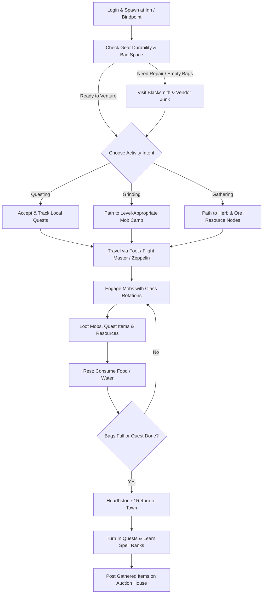
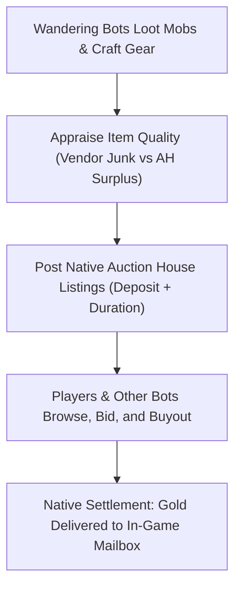

# Living World & Autonomous Bots

TortoiseBots is not limited to player-owned companions. It includes a complete **Living World** subsystem that populates your realm with autonomous bots on **managed pool accounts**. These bots explore zones, grind mobs, gather profession nodes, quest, trade on the Auction House, form parties, and create guilds—making the world feel vibrant and active like a populated MMO server.

> **What "managed" means.** A pool account is one recorded in the character-database table `tortoise_bots_pool_account`: either the module created it itself (auto-create or hiring) or an administrator adopted it explicitly at the server console. A username that merely starts with the configured prefix (`RNDBOT`) does **not** make an account a pool account — such accounts are ignored by the pool and are never reset. See [Resetting the managed bot pool](#resetting-the-managed-bot-pool).

> **Hired companions are guests, not residents.** Players hire companions through the `<Mercenary Hire>` recruiters (see [Player Controls](player-controls.md)). Each hire creates its **own new character** on a managed pool account, and that character is **deleted** when the hire ends — when the companion is kicked or released, when its master leaves the party, when the party disbands, or when the disconnect grace period after the player logs out expires. A dismissed companion never returns to the roaming pool, so it can never drag a player-level character with master-level gear into the organic world. The freed account slot is simply refilled by the normal auto-create target (it never raises or lowers `AiPlayerbot.MinRandomBots`/`MaxRandomBots`), and because the character is gone, the player pays for a fresh companion the next time.

---

## 1. Autonomous Bot Lifecycle


```mermaid
flowchart TD
    Login["Login & Spawn at Inn / Bindpoint"] --> GearCheck["Check Gear Durability & Bag Space"]
    GearCheck -->|"Need Repair / Empty Bags"| Town["Visit Blacksmith & Vendor Junk"]
    GearCheck -->|"Ready to Venture"| GoalChoice{"Choose Activity Intent"}
    Town --> GoalChoice
    GoalChoice -->|Questing| Quest["Accept & Track Local Quests"]
    GoalChoice -->|Grinding| Grind["Path to Level-Appropriate Mob Camp"]
    GoalChoice -->|Gathering| Gather["Path to Herb & Ore Resource Nodes"]
    Quest --> Travel["Travel via Foot / Flight Master / Zeppelin"]
    Grind --> Travel
    Gather --> Travel
    Travel --> Combat["Engage Mobs with Class Rotations"]
    Combat --> Loot["Loot Mobs, Quest Items & Resources"]
    Loot --> Rest["Rest: Consume Food / Water"]
    Rest --> CheckBags{"Bags Full or Quest Done?"}
    CheckBags -->|Yes| Hearth["Hearthstone / Return to Town"]
    CheckBags -->|No| Combat
    Hearth --> TurnIn["Turn In Quests & Learn Spell Ranks"]
    TurnIn --> AH["Post Gathered Items on Auction House"]
```

## 2. Wandering & Leveling Bots

Autonomous bots roam the open world, reacting dynamically to nearby players and wildlife:

| Activity | How It Works in the World |
| :--- | :--- |
| **Zone Exploration & Travel** | Bots take flight paths, ride zeppelins and boats, run along roads between towns, and use hearthstones to return to inns. A pool bot with a far travel target flies toward it on a plan decided once when the target is picked: a KNOWN taxi hop from the nearest flight master to the node nearest the destination, level-valid (area at most +5 above the bot, unknown levels refuse, never an outgrown non-capital, never capital-to-capital), saving real walking, affordable above the trainer reserve. The bot walks to the flight master first, then boards and pays the normal fare — so zone moves like the night-elf Teldrassil exit at 11-12 happen by air instead of on foot. |
| **Grinding & Combat** | Bots seek out level-appropriate hostile mobs, pull with class-appropriate ranged abilities, execute standard rotations, and rest with food and water between fights. A grind target may be picked from up to `AiPlayerbot.SightDistance` (default 60 yd) away, and the order carries the walk to it: melee kits close to contact, ranged kits to casting distance, and only a bot already inside attack range stands still. An autonomous pool bot never starts a fight with a grey (no-XP) creature — it walks past and picks something that pays; it still defends itself when attacked, and quest-objective and ordered kills stay allowed. A target the bot cannot close on for 15 s is given up and blacklisted for five minutes (a second give-up within three minutes moves the bot off the whole spot), so a mob behind geometry is abandoned instead of pinning a bot against it. |
| **Off-hand & Shields** | A shield a bot can wear is not thrown away just because the main hand holds a two-hander (the off-hand is unusable then, and the vendor would previously sell every such shield — they ended up in the buyback window). It is kept only for a bot that can come back to a one-hander and shield (protection specs, or a tank role) and only the single best shield it owns; spares are sold as before. The equipment audit puts the kept shield on the moment a one-hander takes the main hand, a fresh seed moves a leftover shield to the bags instead of destroying it, a protection warrior or paladin that still wields a two-hander swaps to the best one-hander it carries before taking the shield, a shield takes an off-hand weapon even at lower weight (no spec pairs a shield with one), and once the shield is on no weapon ever takes the off-hand slot back (a weapon there reads as not-an-upgrade, so the audit cannot ping-pong), and a shieldless protection or holy bot buys the shield first at the vendor before other weapon upgrades by the same EQUIP rules (own gold, trainer reserve first) and never buys an off-hand weapon. |
| **Grind-spot ladder (level 1-60)** | A bot never stays in a field it has outgrown. A grind destination is only accepted while its creatures sit two levels below to one above the bot (two above from level 10), and coinless wildlife counts, so once the mobs around a bot stop paying level-appropriate XP the travel target that led there goes inactive and the next request walks it — on foot, by taxi, boat or zeppelin, never by teleport — to the nearest field or zone whose creatures still fit: Northshire to the Goldshire fields, Coldridge to Kharanos, Valley of Trials to the Razor Hill/Tiragarde mobs, and on up to the level-60 hunting grounds. Owned/hired bots keep the copper-only conservative window, since their player decides where to hunt. Pool bots search the grind errand nearby (2500 yd, 833 yd below level 5) the way the donor picks local grind spots, and camp errands nearby too (500 yd at level 5 and below, 2500 yd above) — owned/hired bots keep the full search radius, and zone-exit grinds stay uncapped so a bot can still walk out of a valley it has outgrown. Bots also spread over the zone: a spot worked by as many bots as it has room for (a third of its spawns) is skipped in favour of the next candidate range. The area-average level gate that guards travel points allows an autonomous grind destination up to `botLevel + 3` (levels 1-4 keep the wider +5, since a starter valley's own sub-areas are rated far above a fresh bot) — the same margin the destination filter already applies — so the creature band, not the zone average, decides where a bot may hunt: a level-5 bot no longer falls back to the level 1-3 mobs of a starting valley just because the level-appropriate field sits in a higher-rated part of its own zone. The margin stops at three: areas rated bot+4..bot+5 paid the same XP per kill as the first band above the bot's level while killing the bot two to three times as often per 1,000 kills. The outgrown-zone floor is unchanged. |
| **Beginner Grinding (Level 1–4)** | Fresh bots in starter valleys (Valley of Trials, Camp Narache, Northshire, Coldridge, Shadowglen) target mobs up to their own level and are permitted to hunt coinless starter beasts (e.g. Mottled Boars, Scorpids, Plainstriders). Wild XP-granting critter-type beasts (deer, cows) are fair game: the critter skip is gated on the grey-level/no-XP verdict, so true no-XP critters (rabbits) stay skipped. Grind travel skips the zone-average level gate for these bots (their per-mob window already caps targets), so a bot whose spawn hub holds nothing but critters walks to the nearby wolf/trogg field instead of parking at spawn. The order cap follows the character, not the zone: below level 10 a bot picks grind targets at most **one** level above itself (quest objectives excepted), so a fresh bot no longer spends its orders on mobs two to four levels up that it almost never kills; the destination band is level-appropriate here too. A grind pick the core flags as unreachable for that bot is refused (and a held one dropped), so mine shafts and embankments stop pinning bots against geometry. |
| **Two-handers below Dual Wield** | A fury warrior cannot use an off hand before it learns *Dual Wield*, so a two-hander is a real weapon upgrade, not vendor junk: while the bot cannot dual wield the spec accepts the same two-handers arms does (sword/axe/mace/polearm) and the equip audit swaps one in over a weaker one-hander. Once *Dual Wield* is learned the one-hander pair is the rule again, but a two-hander the bot already wields is only replaced by a one-hander that out-scores it — learning the ability never downgrades the weapon in hand. Hunters and enhancement shamans already list their two-handers, and rogues cannot use one at all. |
| **Questing & Progression** | Bots pick up level-appropriate quests from quest givers, track quest objectives (killing specific mobs or collecting items), and turn them in for XP and gold rewards. A masterless pool bot below level 10 only takes a quest rated at most one above its own level, and only walks to a taker whose quest and area both fit that +1 band (tested by `tools/test_quest_taker_level_policy.cpp`): the end-of-valley deliveries (QuestLevel 3-5, taker in the next town) wait until the bot reaches the quest's level, while same-valley quests and hand-ins keep working. |
| **Leisure mixer (pool bots)** | A pool bot's next leisure journey (quest / grind / camp / explore) is drawn from a weighted table - quest 60, grind 15, camp 10, explore 5 - among the purposes available right now (quest: free log slots, quest purpose unparked, rpg-quest strategy on; grind/camp: purpose unparked plus their rpg-phase windows, camp also level 5+; explore: purpose unparked, explore strategy on), instead of the four triggers racing on static relevance. A cached pick is re-checked every read and re-rolled the moment its purpose parks, so no dead verdict ever idles the bot; grind is the fallback and is never mixer-blocked. Service errands (vendor, repair, AH, mail, trainer) always outrank leisure and bypass the roll, as do zone-exit grinds and owned/hired bots. A quest pick still hands in first (rewardable finished quest, player focus order). One trip rolls once (tested by `tools/test_rpg_mixer_policy.cpp`). |
| **Quest-log upkeep (masterless random bots)** | Finished quests that can no longer be rewarded (except transient money blockers) are dropped instead of pinning a log slot, as are grey incomplete deliver quests whose items are gone; grey quests are skipped unless the reward is an equip upgrade; war-effort item turn-ins and banned quests (CLUCK!, inactive templates) are refused at accept; Bone Chew Toy piles are never opened and the toy is destroyed from bags; a nearly-full log is cleaned on a timer only when something is droppable — failed quests and unfinishable solo picks (over-level, elite/dungeon/raid, group-suggested, wrong zone) drop once fewer than two slots are free; turn-in travel starts at the first finished quest and stays on until none remain, and a bot on that trip walks to the taker instead of starting new fights on the way (a mob that engages it still gets the full combat rotation — only the opening strike is given up, because attacking stops the walk). That trip now outranks the grind errand: while the bot carries a quest it can be paid for, the turn-in outranks the next grind destination. Once arrived at a quest objective, five minutes without any kill or item progress parks that quest for 30 minutes instead of being walked again (tested by `tools/test_quest_stall_policy.cpp`): the walk there never counts, explore/event objectives are exempt, the bot moves on to other quests or grind, the parked quest still hands in when finished, and the quest stays in the log. |
| **Gathering & Professions** | Bots gather what they walk past: a herb/ore node in sight and range is opened, a skinnable beast the bot killed itself is skinned right after it is looted (a bot never travels to skin — there is no corpse to walk to). From level 10 a bot with Herbalism or Mining also travels to herb and ore nodes; below that, a node trip would only cross mobs it cannot fight. Every gathered item writes a `GatherLoot` row (skill id + item id) to `bot_events.csv`, next to its `StoreLootAction` row. Materials feed crafting and the Auction House. |
| **Fishing (pool bots, side activity)** | Levelling first: a masterless pool bot with a pole fishes nearby open water only while fully idle — no travel errand, no rewardable finished quest, no vendor/trainer/money/repair need, bags under 90% — and at most one short session per hour (5 casts / 5 min, then the weapon comes straight back). Visible schools first, otherwise the nearest shore inside 40 yd with at most a short step to the bank — never a journey, so the travel/level gates are not bypassed. The cast aims at the water, the zone must be fishable for the bot's skill (same rule as the travel fish errand), guarded shores are refused, combat ends the session at once with the weapon back, and a bot far from any shore rests the search for 15 min instead of re-scanning every tick. Owned/hired bots keep player control and never fish on their own. |
| **Green/blue drop boost (random pool bots)** | A masterless pool bot that kills a creature rolls that creature's own loot template once more for green (quality 2) and blue (quality 3) entries only, at `(multiplier - 1) x` the entry's chance, and finds the hits in the corpse; `AiPlayerbot.BotLootRateUncommon` / `BotLootRateRare` (default `1.0` = off) scale greens and blues separately, so bots gear and sell at a rate closer to their reduced kill count without touching coin. Quest-only drops and quest starters are never boosted, unique items already held are skipped, and a creature that never drops greens gains nothing. Player characters and hired/alt bots keep the server's rates, group loot is never touched, and every hit writes a `BotLootBonus` row to `bot_events.csv`. |
| **Town Life & Immersion** | In towns, bots visit class trainers to learn new spell ranks, repair yellow/red durability gear at blacksmiths, vendor junk items, and wave or say hello when passing human players. A random bot that is idle (not preparing or walking a journey — a bot parked at its destination or working there counts — out of combat, no player master) with a class trainer, vendor or quest giver within 50 yd that it actually needs — a finished quest it can be paid for, an available quest it can take, an affordable unlearned class rank, or a bag-worth of vendor junk (bags at 85 % or over are sold whatever the batch counters say) — walks to that NPC and uses it before asking for a new journey, so a bot standing next to the NPC that would unblock it no longer waits for a travel purpose that may never come (issue #379). The nearby hand-in runs before the nearby accept, and both before the town errands: the hand-in pays out the reward item and its XP and frees the log slot the accept needs, while accepting costs nothing. Each firing writes a `NearbyService` row (kind + NPC entry) to `bot_events.csv`, and the accept itself is also logged as `AcceptQuestAction` — including the quest-details path a bot reaches through an RPG-time hello, which used to be the one invisible accept. Bags that full with no vendor within 50 yd instead request the ordinary `Vendor` travel target (the "sell items to" trip), so a bot out in the field walks back to town to sell; that request is allowed to leave a bot that is merely parked at its destination (arrived, working it, or in cooldown) — only a journey in flight holds it — and the vendor search runs without the RPG destination pre-filter, exactly like the named trainer errand, so a vendor in the starter camp is reachable. The trip needs a real reason — stock a vendor pays for and that is worth the walk (greys or surplus gear; never the bot's own food, drink, bandages, potions, spell reagents, ammo or quest items, which the sell paths no longer hand over), a durability below the repair threshold, or an empty food/drink bag the bot can pay to refill (a starting bot used to satisfy the old loose test with its own rations and walked to town with nothing to sell) — and a fruitless visit (nothing vendor-usable sold) parks that errand for ten minutes, a park the travel request itself now reads, and logs `SellErrandFailed` with the reason — the vendor counterpart of the trainer's fruitless-visit park and `TrainerNoMoney`. Autonomous travel picks ("Traveling 123y to ..."), vendor confirmations ("Selling ...") and bot-to-bot trade/enchant lines stay silent unless a live player asked — a direct reply to a player's command still answers. The "WTS"/"I am selling" trade spam is off by default (`AiPlayerbot.BroadcastChanceSuggestSell = 0`). A fresh bot's race intro cinematic ends on world entry (and any later cinematic on its AI tick), so it is attackable from its first login; RPG use never picks camera objects. |

### Persistent Bot Initial Skills (`DisableRandomLevels = 1`)

For servers configured to run persistent, organically leveling bots starting at level 1 (`AiPlayerbot.DisableRandomLevels = 1`):
* **Weapon Skills:** Bots receive full class-compatible weapon proficiencies on their first login, scaled to their current level cap (e.g., 5/5 at level 1). This ensures melee and ranged attacks connect reliably instead of missing 80% of the time at 1/5 weapon skill.
* **Ranged Shoot Abilities:** a weapon skill also teaches that weapon's *shoot* ability (*Shoot Bow*, *Shoot Gun*, *Shoot Crossbow*, *Throw*, wand *Shoot*, hunter *Auto Shot*). Bots get them from the same skill-reward table the game itself uses (`skill_line_ability`), whenever the factory seeds skills (`MakeComplete`, `ProvisionSpellsAndGear`) and once per bot login for characters created before it. Without the ability a bot with a bow, arrows and the Bows skill cannot shoot at all: the AI resolves a spell name only against the bot's own spellbook, so the ranged pull and the *shoot* fallback would silently do nothing. Wand *Shoot* carries the same effect as melee strike abilities (`WEAPON_DAMAGE_NOSCHOOL`), so it is only learned for the weapon-skill line that teaches it (*Wands*), never for a class skill like *Arms*.
* **Dual Wield class level:** Dual Wield is the one ability the data cannot gate for bots — skill 118's `SkillRaceClassInfo` row for warrior/hunter is overridden to `MinLevel 1` by `skill_race_class_info_mod` id 132 ("Show Dual Wield on trainers at all levels"), so nothing keeps a level-5 bot from ending up with skill 118 and spell 674; a rogue row is untouched and says 10. The factory therefore applies explicit thresholds, taken from the live trainer data (`npc_trainer` for the teaching spell 1424: warrior 10 in 29 trainers, hunter 20 in 39) and the owner's call for the rogue (10, even though its 22 trainers say 20): **warrior 10, rogue 10, hunter 20**. Below its threshold a bot is never taught the Dual Wield spell, and at every login the factory strips what it already carries — spell 674, skill 118 and the session flag — while leaving equipment alone: `Player::SetCanDualWield` is a plain flag, nothing in the core unequips the off-hand when it goes false, and an off-hand weapon simply stops contributing until the bot earns the ability (shields are unaffected either way, they never needed the flag). At or above the threshold everything works as described above. Classes that cannot dual wield in this game (shamans get it only in TBC) never get it either: the earlier hard-coded level-10 grant for shamans is gone, and a shaman that still carries the spell or skill loses both at login.
* **Dual Wield, Block and weapon abilities:** the same pass learns every other ability a skill the bot owns teaches, because the core gates those abilities on the *spell*, not on the skill: *Dual Wield* (spell 674) is what lets the core put a second weapon in the off-hand (a bot with skill 118 and a spare dagger in its bag stayed main-hand-only) and *Block* (spell 107) is what makes a shield block. The per-session flags those passives carry (*m_canDualWield*, *m_canParry*, *m_canBlock* are never saved) are restored on every pass from the abilities the bot knows, *Parry* included — its `skill_line_ability` row has `learnOnGetSkill = 0` (it is trainer-taught and seeded in `InitSkills`), so it is the flag sweep, not the learn pass, that brings it back after a login. The pass is idempotent and learns nothing else a skill rewards (profession recipes and the client's helper spells stay out of the spellbook).
* **Trade Skills:** Bots receive their two class-matched primary professions at level 5 (together with the matching tools), not at creation: levels 1-4 run with weapon skills plus First Aid, Cooking and Fishing only. From level 5 the roll is the same pair table as before, with one exception below: every other pair holds at least one gathering, and the second is either the craft that gathering feeds or a second gathering, never a second craft (a craft without its gathering can never be skilled or fed). Warriors/Paladins roll Mining + Blacksmithing or Mining + Engineering; Rogues/Hunters/Shamans/Druids roll Skinning + Leatherworking, Mining + Engineering or Skinning + Mining; casters roll the Herbalism/Alchemy, Herbalism/Mining, Mining/Skinning or Herbalism/Skinning pairs, except that about 1 in 3 mages, priests and warlocks roll the Tailoring + Enchanting pair instead (the one allowed craft+craft pair, owner decision: neither craft has a feeding gathering, so those bots skill only through trainer recipes and loot cloth). A bot at level 5+ without primaries (created before the rule) earns the pair on its next level-up or login; a bot that already holds any primary is never re-rolled. Tailoring needs no tool; Enchanting ships its Runed Arcanite Rod (item 16207) with the grant.
* **Persistence:** Seeding runs once per fresh bot (it is skipped when the bot already has a primary profession or has played time); the professions and skills themselves are saved as normal character data, so they are never re-rolled across restarts.

### Fresh-Bot Field Kit (bags, soul bag, ammo, thrown, tools, mounts, money, bandages)

Every fresh seed (pool login via `MakeComplete`, hire via `ProvisionSpellsAndGear`) also grants a usable field kit, idempotently — re-seeds only fill gaps, never duplicate:
* **Bags:** three 14-slot Journeyman's Backpacks (item 3914) in the plain container slots, plus level-tier vendor-bag upgrades through the normal equip path. Hunter quiver/ammo-pouch slots stay reserved for the quiver. Bots created before this set get it on the next login or level-up (`EnsureStarterKit`), which never moves earned items.
* **Soul bag:** warlocks also get a Small Soul Pouch (item 22243, 12 slots), upgraded through the normal soul-bag equip path as bigger ones drop.
* **Ammo container + ammo (hunters):** the quiver/ammo pouch matches the equipped ranged weapon (gun -> pouch, bow/crossbow -> quiver) and upgrades itself by level from vendor-sold rows only; ammo is server-managed by level and re-synced when the weapon family changes, topped up by the existing per-tick item cheat.
* **Thrown weapon (rogues/warriors):** a single level-tier thrown weapon for ranged pulling, upgraded by the same server-managed ladder (no stack, never shopped for).
* **Profession tools:** mining pick, skinning knife, blacksmith hammer, arclight spanner and fishing pole, matching the bot's professions. Mining/skinning/fishing cannot run without them.
* **Mounts:** Swift Riding Turtle (spell 30174) at `AiPlayerbot.TurtleMountAtLevel` (default 18) through 39, race/class mount spell at 40 (apprentice) and 60 (journeyman); riding skill is already level-gated. Masterless random bots also earn the turtle on level-up, and with `AiPlayerbot.LevelUpMounts` (default 1) they earn the 40/60 mount on the level-up too instead of only when seeded (`0` = seed/hire only). The grant is idempotent per tier, so re-seeding never stacks mounts. Mount speed follows riding skill like every player mount (riding 0 -> level/2, 75 -> 60%, 150 -> 100%), so level-60 bots ride at 100% and 40-59 bots at 60%.
* **Money:** a level-scaled starting amount on first seed only — never refilled on re-seed, so vendor/AH/repair economy stays earned.
* **Bandages:** one half-stack at the First Aid tier; class reagents, food/drink and potions come from the existing seed tables.
* **Hired-companion restock:** hired companions get a cheap hourly top-up (reagents, food/drink, potions, bandages, each bounded to a small stack). Tools and bags stay one-time seed.
---

## 3. Fresh-Bot Level Seed

A common issue with bot realms is a whole pool stuck at level 1 while you level a fresh character. TortoiseBots seeds each fresh pool bot once, on its first login, at a random level in `AiPlayerbot.RandomBotStartLevelMin`/`Max` (default 1–60, so the realm has bots at every level; for example 10–15 for a test pool, 1/1 keeps the historic level-1 start). With `AiPlayerbot.LevelLadder` (on by default) the online share is also spread by level band:

* Bots level up normally from their seed through grinding, questing, and XP.
* The same class gates a pool bot as a player: a hunter owns no pet below level 10 (*Tame Beast*, spell 1515). A level-1 hunter in a fresh pool is pet-less, gets a random level-appropriate pet when it reaches 10, and a pool hunter logging in below 10 gives up a pet an older pool seeded for it. Player-owned, hired and adopted hunters keep theirs.
* New random bots are spread evenly across the six racial starting zones (`AiPlayerbot.RandomBotEvenStartZones = 1`): auto-create picks a valid race from the least-populated start zone (counted once per creation batch, pool characters below level 10, so bots that level during a big creation run still count). Goblins count toward Durotar and high elves toward Elwynn, and their relocation from the isolated custom starts always lands in Valley of Trials / Northshire, so each bot plays in the zone it was counted for. Set `0` for the old behaviour (uniform random race).

---

## 4. Social Interaction: Groups & Guilds

Random bots actively participate in realm social structures:

### Party & Dungeon Invites
* **Inviting Lone Players (`RandomBotInvitePlayer = 1`):** If you are questing solo in an area, nearby random bots on matching quests or grinding in the same camp will invite you to form a party. (If you prefer to solo, turning on `/dnd` stops bot invites).
* **Bot-to-Bot Grouping (off by default, `RandomBotGroupNearby = 0`):** Pool bots stay solo so bot-led groups cannot leash members into idle followers. The pool-bot skip/decline applies only when this is `0` (inviting real players still follows `RandomBotInvitePlayer`). Set `1` to let bots organically group up with nearby bots for difficult quest mobs, elite areas, and dungeons.

### Autonomous Guild Formation (`RandomBotFormGuild = 1`)
* Bots periodically visit guild masters in capital cities, purchase a **Guild Charter**, and collect signatures from other unguilded bots.
* Once registered, bots create custom guild names, invite fellow bots and players, and display guild names over their heads.

---

## 5. The Living Auction House Economy (`AhMarketService`)

TortoiseBots features an active, simulated player economy that prevents the Auction House from feeling like a ghost town:


```mermaid
flowchart TD
    Loot["Wandering Bots Loot Mobs & Craft Gear"] --> Appraise["Appraise Item Quality (Vendor Junk vs AH Surplus)"]
    Appraise --> Post["Post Native Auction House Listings (Deposit + Duration)"]
    Post --> Trade["Players & Other Bots Browse, Bid, and Buyout"]
    Trade --> Mail["Native Settlement: Gold Delivered to In-Game Mailbox"]
```

* **Bot Sellers:** Bots list surplus profession mats (cloth, herbs, ore, leather), green/blue Bind-on-Equip (BoE) gear, and crafted consumables on the Auction House at realistic market prices.
* **Bot Buyers:** When bots accumulate gold, they periodically search the Auction House for gear upgrades suited to their class and spec. If an item on the AH is better than their current equipped gear, they place bids or buyout the listing.
* **Personal Settlement:** Items sold or bought by bots use native core auction mechanics. Human players receive real gold in their mailbox when a bot buys their auctions.

Switches: `AiPlayerbot.AhMarketEnabled = 1` turns on bots posting and bidding with their own inventories (random bots must be logged in, i.e. `AiPlayerbot.RandomBotAutologin = 1`). The server-generated extras are separate and off by default: `AiPlayerbot.AhMarketSyntheticSupply = 1` (synthetic listings) and `AiPlayerbot.AhMarketBuyer = 1` (synthetic buyer).

Organic buyer (issue #405, no buyer teleport): the synthetic buyer bids only with a pool bot already standing at an auctioneer serving the listing's house (arrived on its own feet, e.g. on a sell trip). Demand comes from the normal AH travel purpose: a masterless pool bot level 10+ whose own map holds an auction house, holding 5 gold of spendable purse (the same "free money for anything" the arrival bid reads), walks/flies there like the seller in the first 3 minutes of the hourly RPG phase only, one trip per bot per 10 minutes, and bids on arrival through the usual `rpg ah buy` action. Scans touch 8 bots per listing with a rotating start so the whole pool is covered over passes, and grouped / LFT / battleground / instance bots are never touched.

### Auction House Administration Commands (`.bot ah` / `.ahbot`)
* `.bot ah status` — Inspect active listings, inventory counts, and market passes.
* `.bot ah reload` — Reload overrides and blacklists from the `ahbot_items` database table.
* `.bot ah rebuild [all]` — Triggers an immediate market pass (`all` expires active unbid synthetic items).
* `.bot ah item <id>` — Checks blacklist status or custom price overrides for an item.
* `.bot ah item <id> reset` — Removes custom override and restores formula pricing.
* `.bot ah item <id> <value> [chance] [min] [max]` — Overrides pricing or blacklists an item (`0 0`).

---

## 6. Automated Dungeon & Battleground Queues

### Looking-For-Trouble (LFT) Dungeon Autofill
* Config: **`AiPlayerbot.RandomBotLftEnabled = 1`** (on by default; set `0` to opt out)
* When human players queue in the LFT tool and sit waiting for missing roles (especially Tanks or Healers), the module checks idle random bots in the world matching that level bracket. Random bots only fill while a real human waits — never autonomously.
* Eligible bots auto-queue and accept the dungeon invite; the group then walks to the dungeon together (bots follow their master into the portal via the master's area-trigger). There is **no teleport or summon**: bots far from the portal need `.bot summon`.
* Role match is fail-closed on each bot's own spec: a tank slot needs a natural tank with a shield actually equipped (best shield from bags is equipped first), a druid tank needs bear form, a healer needs healing spells. A missing role stays empty with a logged skip reason instead of being filled badly. Set `AiPlayerbot.RandomBotLftAllowRoleBorrow = 1` only to opt back into respec-into-role borrowing.

### Dungeons With Your Own Party Bots
* Queue in the LFT tool with your own managed bots in the party (alts/hires): the core auto-answers the rolecheck for them — your explicit `.bot role <Name> <tank|healer|dps|clear>` (or `role self`, same override) wins first, then the role/spec buttons (TBM party frame or `.bot command <Name> <strat>`): named combat specs answer (`protection`/`tank feral` tank; `holy`/`discipline`/`restoration` heal; every DPS spec dps — ambient `tank assist`/`dps assist` ignored). With neither set, automatic spec/gear detection applies.
* Your bots **auto-accept the dungeon offer** on the fill service's tick cadence, so the 90s native offer timer no longer expires on them. This works whether `RandomBotLftEnabled` is on or off; the random-fill switch only gates random-pool fill, not your party.
* After the group forms, bots follow you to the portal — bring them along or `.bot summon` stragglers first, since there is no automatic teleport.

### Battleground Auto-Queue
* Config: **`AiPlayerbot.RandomBotBgEnabled = 1`** (on by default; set `0` to opt out)
* Monitors PvP queues for **Warsong Gulch (WSG)**, **Arathi Basin (AB)**, and **Alterac Valley (AV)**.
* When real players queue up, random bots queue to balance faction team sizes and launch the battleground, allowing you to play active PvP battlegrounds even on low-population private servers. Random bots only queue while a real human waits in the queue — unless you opt into autonomous bot-only matches below.

### Autonomous Bot-Only Matches (on by default; set `0` to opt out)
* Config: **`AiPlayerbot.RandomBotBgAutonomous = 1`** (on by default; set `0` to opt out) + `AiPlayerbot.RandomBotBgAutonomousMaxInstances = 1` (cap for an average PC: one 10v10 at a time).
* When nobody is queued, pool bots start their own Warsong Gulch in the most populated level bracket so they have matches of their own. Human demand always wins: the seeder only runs when no real player is waiting in any queue (invited/in-match humans don't count), so new seeds stop as soon as someone queues.
* Seeds are solo bots only (grouped bots stay out). Batches of 1 accumulate each tick until both sides reach 10v10;
  once the match starts forming, top-up stops and the queued seeds are absorbed. Cap is per bracket (default 1).
  Requires `AiPlayerbot.RandomBotBgEnabled = 1` (the seeder runs inside the backfill tick).

### Battlegrounds With Your Own Party Bots
* Queue at the battlemaster with **Join as Group**: the core group-join check passes headless bot members like any player (same team, in world, level bracket, no deserter), so your party — you plus your own managed bots — enters the queue together. **WSG and AB** support group joins; **AV rejects group joins in the core**, so queue AV solo alongside your bots instead.
* Your bots **auto-accept the BG invite** (`STATUS_WAIT_JOIN` → port) through the same `bg status` packet action random bots use, then drop `follow` and run the per-map BG strategies (`warsong`/`arathi`/`alterac` + `pvp`) for the duration of the match.
* The auto-queue service never touches your party bots: master-reclaim reconciliation and lease eviction only cancel queue entries the service itself queued, and human-demand accounting counts only non-headless real players — your bots (or random fill bots) never create fake demand.

---

## 7. Recommended Living World Configuration

To enable a full living world on your server, ensure these toggles are set in `conf/aiplayerbot.conf`:

```ini
# Master bot toggle
AiPlayerbot.Enabled = 1

# Random bot population pool
AiPlayerbot.RandomBotAutologin = 1
AiPlayerbot.RandomBotAutoCreate = 1
AiPlayerbot.MinRandomBots = 60
AiPlayerbot.MaxRandomBots = 150

# Fresh-bot level seed (verified 10–15 test pool). A seeded bot learns its
# class spells up to the seed level once; later levels are trained at a trainer.
AiPlayerbot.RandomBotStartLevelMin = 10
AiPlayerbot.RandomBotStartLevelMax = 15

# Social immersion
AiPlayerbot.RandomBotInvitePlayer = 1
AiPlayerbot.RandomBotGroupNearby = 0
AiPlayerbot.RandomBotFormGuild = 1
AiPlayerbot.EnableGreet = 1

# Optional living economy & queues
AiPlayerbot.AhMarketEnabled = 1
AiPlayerbot.RandomBotLftEnabled = 1
AiPlayerbot.RandomBotBgEnabled = 1
```
---

## 8. Resetting the Managed Bot Pool

Changes to fresh-character seeding, starter gear, professions, or skills only reach bots that are created afterwards. To rebuild the existing pool — same login accounts, brand-new characters — set a one-shot generation token and restart:

```ini
# conf/aiplayerbot.conf
AiPlayerbot.RandomBotPoolReset = once:gear-seeding-v2
AiPlayerbot.RandomBotAutoCreate = 1
```

The reset runs **only** during initial world startup, deletes the characters on managed pool accounts one at a time on the world thread, verifies that nothing is left, records the generation, and then regenerates the pool toward `MinRandomBots`/`MaxRandomBots`. `.reload config` never starts a reset, and there is no live reset command — a running world is never mutated behind the players' backs.

### Modes

| Value | Behaviour |
| :--- | :--- |
| `off` | Never reset automatically. This is the default and the recommended production setting. |
| `once:<token>` | Reset on the next server start **only if** `<token>` differs from the last completed generation. Re-using the same token is a no-op, so the value can safely stay in the config. Change the token for every new rebuild. |
| `always` | Reset on **every** server start. Development only — every restart destroys bot progression. |
| anything else | Invalid: it is logged and nothing is reset. |

### Step-by-step (existing installation)

```text
1.  Back up the character database.
2.  Start the server with AiPlayerbot.RandomBotPoolReset = off.
3.  At the server console run: bot pool status
4.  Upgrading an old installation? Run: bot pool adopt preview
5.  Review the listed accounts and run the exact confirmation command it prints:
        bot pool adopt confirm <challenge>
6.  Run: bot pool status        (managed accounts should now match)
7.  Stop the server normally.
8.  Set AiPlayerbot.RandomBotPoolReset = once:<new-token>
9.  Start the server and watch the log for:
        TortoiseBots: random pool generation '<new-token>'; reset scheduled for ...
        TortoiseBots: random pool reset progress: ...
        TortoiseBots: random pool reset verified: 0 characters remain ...
        TortoiseBots: random pool generation '<new-token>' applied; pool rebuild starts now
10. Run: bot pool status        (phase complete, characters regenerating)
```

Adoption (`bot pool adopt preview` / `confirm`) only **registers** accounts. It never deletes, moves, or edits a character, and it is available only at the server console.

### What a reset intentionally loses

- bot level, gear, bags, bank, quests, and profession progression;
- hired companions that were riding the pool (any hire character still on a pool account — its hire-ledger and durable ownership rows are cleared with the character);
- pinned bot names and their saved GUIDs (pins resolve again once new characters exist);
- guilds that consist only of pool characters (a guild holding anyone outside the pool blocks the reset instead — see below);
- bot-owned auction listings: active bidders are refunded through the core's normal auction mail before the listing is removed, and the listed item is destroyed with the character.

### Safety guarantees

- Only registered pool accounts are ever touched; `RNDBOTPersonal`-style personal accounts stay untouched unless an administrator adopts them.
- Every registered account is re-validated against the login database (existence **and** username) before the first deletion; a missing, renamed, or unreadable account aborts the reset.
- Human sessions are never logged out or deleted: a pool character being played by a player aborts the reset before anything is deleted.
- A bot-led guild with any member outside the pool aborts the reset and names the guild and its leader.
- The generation is recorded only after deletion **and** verification succeed, so a crash mid-reset resumes on the next start instead of being marked as done.
- While a reset is running (or after it fails), hiring, auto-create, autologin, and battleground selection stay paused. The pool is also unavailable whenever the registry itself cannot be validated, so nothing creates or hires pool characters while the module cannot tell its own accounts apart.
- Every auction owned by a pool character is settled in a dedicated phase **before the first deletion**, while all pool bidders still exist. A pool bot bidding on another pool bot's listing therefore cannot block the reset (its refund is issued while it is still there to receive it), and a bid that still cannot be refunded stops the reset instead of being lost silently. A hardcore bidder is deliberately not refunded — the same rule the core applies when an auction is cancelled. A listing that somehow appears after settlement stops the reset rather than being deleted unrefunded.
- An empty managed set (nothing registered, or no characters on the registered accounts) is a verified no-op: the generation is still recorded, so a token cannot silently wipe a pool that auto-create builds afterwards.
- Login accounts are always retained; only their characters are rebuilt.
